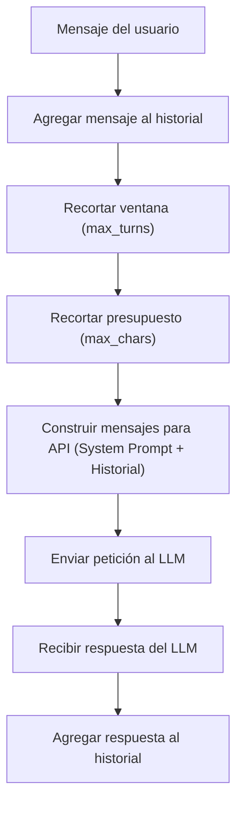

# Estrategia de Manejo de Contexto

## 1. Introducción

Los modelos de lenguaje grande (LLMs) poseen ventanas de contexto finitas y costos asociados al volumen de tokens procesados en cada llamada a la API. En un asistente conversacional de tutoría, a medida que la conversación progresa, acumular la totalidad de los mensajes históricos genera problemas críticos:

- **Desbordamiento de la ventana de contexto**: Riesgo de exceder el límite máximo de tokens admitido por el modelo.
- **Incremento de latencia y costo**: El procesamiento repetido de historiales extensos encarece y ralentiza cada interacción.
- **Degradación de la atención**: Introducción de ruido y distracción para el LLM por información antigua o no relacionada con el ejercicio actual.

Por estas razones, Cubik-Lite requiere una estrategia determinista, eficiente y predecible para gestionar el historial conversacional.

---

## 2. Estrategia elegida: Sliding Window (Ventana Deslizante)

La estrategia adoptada para Cubik-Lite es la de **Ventana Deslizante (*Sliding Window*) con preservación del *System Prompt***.

### Mecánica de funcionamiento:
1. **Preservación fija del System Prompt**: El mensaje de sistema inicial (definido en `prompts/system_prompt.txt`), que establece el rol pedagógico, reglas de formato JSON y comportamiento de rechazo, se mantiene **siempre presente e inmutable** en la primera posición.
2. **Ventana de los últimos $N$ turnos**: Se conservan únicamente los últimos $N$ turnos de interacción (donde un turno comprende un mensaje de usuario y la respectiva respuesta del asistente).
3. **Descarte FIFO (First-In, First-Out)**: Cuando el número de turnos en el historial supera el límite configurado (`max_turns`), los turnos más antiguos se descartan automáticamente.
4. **Presupuesto de caracteres/tokens**: Si la suma de caracteres de los mensajes dentro de la ventana supera un umbral máximo (`max_chars`), se descartan mensajes antiguos adicionales dentro de la ventana activa para garantizar que nunca se sobrepase el presupuesto de tokens.

---

## 3. ¿Por qué Sliding Window?

Esta estrategia se alinea perfectamente con las necesidades y características del dominio de tutoría de cálculo integral:

- **Sesiones de longitud corta o media**: Las sesiones de estudio suelen centrarse en resolver entre 1 y 5 ejercicios puntuales.
- **Relevancia del contexto inmediato**: La resolución paso a paso de un ejercicio de integración requiere que el asistente recuerde las aclaraciones y pasos recientes del problema en curso. Los ejercicios completados varios turnos atrás dejan de ser relevantes para el problema actual.
- **Simplicidad de implementación y depuración**: No introduce dependencias externas, llamadas intermedias a modelos auxiliares ni estados complejos, lo que facilita pruebas unitarias reproducibles y un mantenimiento ágil.
- **Uso predecible de memoria y costos**: Garantiza un consumo de tokens acotado con un límite superior conocido en todo momento.

---

## 4. Alternativas consideradas

| Estrategia | Descripción | Ventajas | Desventajas | Decisión para Cubik-Lite |
|---|---|---|---|---|
| **Full History (Historial Completo)** | Enviar todo el historial acumulado desde el inicio de la sesión. | Muy simple de implementar; conserva el registro íntegro. | Supera el límite de tokens en sesiones largas; aumenta la latencia y los costos linealmente. | **Descartada**: Inviable para sesiones prolongadas. |
| **Summarization (Resumen Periódico)** | Usar un LLM auxiliar para sintetizar los turnos antiguos y mantener un resumen en contexto. | Conserva memoria a largo plazo de temas cubiertos. | Añade latencia significativa, costo adicional por llamadas de resumen y complejidad propensa a errores. | **Descartada**: Sobrecarga innecesaria para el alcance de tutoría de ejercicios. |
| **Hybrid (Ventana + Resumen)** | Combinar una ventana deslizante reciente con resúmenes condensados del pasado. | Retención óptima tanto a corto como a largo plazo. | Alta complejidad de orquestación, gestión de estado y mayor latencia. | **Descartada**: Complejidad excesiva para la fase actual del proyecto. |
| **Sliding Window (Ventana Deslizante)** | Preservar el system prompt y los últimos $N$ turnos con control de presupuesto. | Predecible, rápida, económica, robusta y perfectamente adaptada al flujo de ejercicios. | No retiene memoria de ejercicios resueltos mucho tiempo atrás. | **Seleccionada**: Solución óptima para el alcance del tutor. |

---

## 5. Parámetros de configuración

| Parámetro | Tipo | Valor por defecto | Descripción |
|---|---|---|---|
| `max_turns` | `int` | `10` | Número máximo de turnos recientes (pares usuario-asistente) que se retienen en la ventana deslizante. |
| `max_chars` | `int` | `12000` | Límite máximo de caracteres acumulados en el historial para controlar el presupuesto de tokens. |

---

## 6. Diagrama de flujo

El siguiente diagrama ilustra el ciclo de vida de un mensaje y la aplicación de la estrategia de contexto:

---

## 7. Implementación

La lógica de manejo de contexto se encuentra implementada y testeada en los siguientes módulos del repositorio:

- **Gestor de contexto**: [`context_manager.py`](../context_manager.py)
- **Pruebas unitarias**: [`test_context_manager.py`](../tests/test_context_manager.py)
