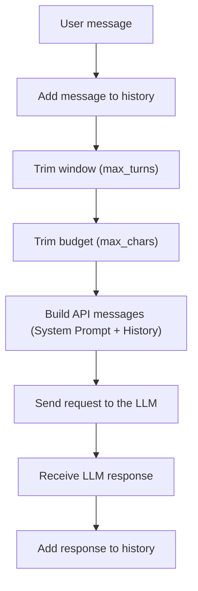

# Context Management Strategy

## 1. Introduction

Large language models (LLMs) have finite context windows and costs tied to the volume of tokens processed in each API call. In a conversational tutoring assistant, as the conversation progresses, accumulating every historical message causes critical problems:

- **Context window overflow**: Risk of exceeding the maximum number of tokens the model supports.
- **Increased latency and cost**: Repeatedly processing long histories makes each interaction more expensive and slower.
- **Attention degradation**: Old information, or information unrelated to the current exercise, introduces noise and distracts the LLM.

For these reasons, Cubik-Lite needs a deterministic, efficient and predictable strategy to manage the conversation history.

---

## 2. Chosen strategy: Sliding Window

The strategy adopted for Cubik-Lite is a **Sliding Window with *System Prompt* preservation**.

### How it works:
1. **Fixed preservation of the System Prompt**: The initial system message (defined in `prompts/system_prompt.txt`), which sets the pedagogical role, the JSON format rules and the refusal behavior, is kept **always present and unchanged** in the first position.
2. **Window of the last $N$ turns**: Only the last $N$ interaction turns are kept (where a turn consists of a user message and the corresponding assistant reply).
3. **FIFO (First-In, First-Out) eviction**: When the number of turns in the history exceeds the configured limit (`max_turns`), the oldest turns are discarded automatically.
4. **Character/token budget**: If the total number of characters of the messages inside the window exceeds a maximum threshold (`max_chars`), additional old messages inside the active window are discarded to guarantee that the token budget is never exceeded.

---

## 3. Why Sliding Window?

This strategy fits the needs and characteristics of the integral calculus tutoring domain very well:

- **Short or medium-length sessions**: Study sessions usually focus on solving between 1 and 5 specific exercises.
- **Relevance of the immediate context**: Solving an integration exercise step by step requires the assistant to remember the recent clarifications and steps of the problem in progress. Exercises completed several turns earlier are no longer relevant to the current problem.
- **Simple to implement and debug**: It introduces no external dependencies, no intermediate calls to auxiliary models and no complex state, which makes reproducible unit tests and lightweight maintenance easier.
- **Predictable memory use and costs**: It guarantees bounded token consumption with a known upper limit at all times.

---

## 4. Alternatives considered

| Strategy | Description | Advantages | Disadvantages | Decision for Cubik-Lite |
|---|---|---|---|---|
| **Full History** | Send the whole history accumulated since the start of the session. | Very simple to implement; keeps the complete record. | Exceeds the token limit in long sessions; latency and costs grow linearly. | **Discarded**: Not viable for long sessions. |
| **Summarization (Periodic Summary)** | Use an auxiliary LLM to condense old turns and keep a summary in context. | Keeps long-term memory of the topics covered. | Adds significant latency, extra cost for the summary calls, and error-prone complexity. | **Discarded**: Unnecessary overhead for the scope of exercise tutoring. |
| **Hybrid (Window + Summary)** | Combine a recent sliding window with condensed summaries of the past. | Optimal retention in both the short and long term. | High orchestration complexity, state management and higher latency. | **Discarded**: Excessive complexity for the current phase of the project. |
| **Sliding Window** | Preserve the system prompt and the last $N$ turns with budget control. | Predictable, fast, cheap, robust and well suited to the exercise flow. | Does not retain memory of exercises solved long ago. | **Selected**: The best solution for the tutor's scope. |

---

## 5. Configuration parameters

| Parameter | Type | Default value | Description |
|---|---|---|---|
| `max_turns` | `int` | `10` | Maximum number of recent turns (user-assistant pairs) kept in the sliding window. |
| `max_chars` | `int` | `12000` | Maximum number of characters accumulated in the history, used to control the token budget. |

---

## 6. Flow diagram

The following diagram shows the life cycle of a message and how the context strategy is applied:

---

## 7. Implementation

The context management logic is implemented and tested in the following repository modules:

- **Context manager**: [`context_manager.py`](../../context_manager.py)
- **Unit tests**: [`test_context_manager.py`](../../tests/test_context_manager.py)
