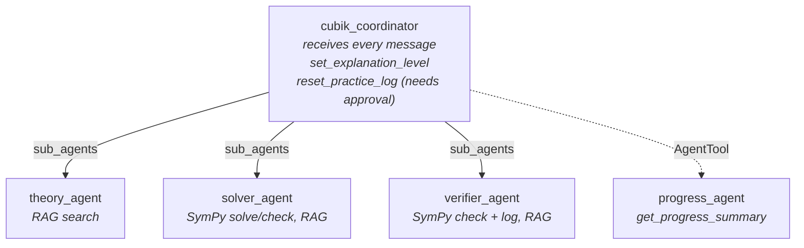

# Multi-agent design (Corte 2)

This document defines the agent team that replaces the single tutor in
[`agents/cubik_tutor/`](../../agents/cubik_tutor/agent.py) for Corte 2. It refines the proposal in
[PROPOSAL.md](../../PROPOSAL.md) (a triage agent plus agents that solve) with the Week 8 patterns:
handoff with `sub_agents`, `AgentTool` and workflow agents. The implementation is in
[`agents/cubik_team/agent.py`](../../agents/cubik_team/agent.py).

The problem does not change: integral calculus tutoring grounded in `data/` through RAG. Two things change:

- Each agent has a narrower instruction and set of tools, instead of a single prompt that covers every
  case.
- Mathematical results no longer depend on the model: they are computed and checked with **SymPy**. The LLM
  explains and writes the step-by-step solution, but the final answer and the verdict on whether an answer is
  correct come from a symbolic computation.

## 1. Team

A coordinator classifies each message and sends it to one of four specialists. The `description` fields are in
English because they are the exact text ADK shows the model for routing.

| Agent | Responsibility | `description` | Tools |
|---|---|---|---|
| `cubik_coordinator` (root) | Receives every message, routes it, rejects anything out of scope, stores the detail preference and resets the practice log with the student's approval. | Entry point of the integral calculus tutor: classifies each student message and routes it to the right specialist. | `set_explanation_level`, `reset_practice_log` (needs approval), `AgentTool(progress_agent)` |
| `theory_agent` | Answers conceptual questions. | Explains integral calculus concepts, definitions and theorems (e.g. why +C, the Fundamental Theorem), citing the knowledge base. Does not solve or check specific exercises. | `search_knowledge_base` |
| `solver_agent` | Solves an exercise the student brings without an answer. | Solves a specific integral the student asks to be solved, step by step, naming the technique and the rule behind each step. Does not answer theory questions or check the student's own answers. | `solve_integral`, `search_knowledge_base`, `check_antiderivative`, `check_definite_integral`, `log_practice_attempt` |
| `verifier_agent` | Reviews the answer (or the step-by-step work) the student brings. | Checks the student's own answer to a specific integral against an exact SymPy computation, and explains the mistake if it is wrong. Does not solve exercises the student has not attempted. | `check_student_antiderivative`, `check_student_definite_integral`, `search_knowledge_base` |
| `progress_agent` | Summarizes the practice progress. | Summarizes the student's practice progress per technique. | `get_progress_summary` |

The boundary between `solver_agent` and `verifier_agent` is what the student brings:

- Only the exercise ("resuelve ∫ x·e^x dx" (solve ∫ x·e^x dx)) → `solver_agent`.
- The exercise **and its answer or its step-by-step work** ("¿está bien? ∫ x·e^x dx = x·e^x − e^x + C" (is
  this right? ∫ x·e^x dx = x·e^x − e^x + C)) → `verifier_agent`.

`search_knowledge_base`, `set_explanation_level`, `log_practice_attempt`, `get_progress_summary` and
`reset_practice_log` are the tools from `agents/cubik_tutor/agent.py`. They are imported from there, not
duplicated (`reset_practice_log` arrives wrapped in `reset_practice_log_tool`, which asks for approval before it runs). The SymPy tools are new (section 3).

## 2. Delegation type

| Specialist | Delegation | Why |
|---|---|---|
| `theory_agent` | `sub_agents` (handoff) | It answers the student directly with the JSON format; the coordinator has nothing to add. |
| `solver_agent` | `sub_agents` (handoff) | It answers the student directly with the step-by-step solution. |
| `verifier_agent` | `sub_agents` (handoff) | It answers the student directly with the verdict and the explanation of the mistake. |
| `progress_agent` | `AgentTool`, called by the coordinator | It returns short data that the coordinator includes in its own answer. |

The three `sub_agents` specialists **cannot transfer** (`disallow_transfer_to_parent` and
`disallow_transfer_to_peers` set to `True`). They answer the message they receive and the next one goes back to
the coordinator. Section 5 explains why.

The solver does not need the verifier as an agent to check its own result: it calls the
`check_antiderivative` or `check_definite_integral` function directly, which is deterministic and does not spend
model calls.

## 3. SymPy tools

The calculus tools live in [`math_tools.py`](../../math_tools.py), at the repo root (next to `retriever.py`).
They take the expressions as text. They accept SymPy syntax (`x*exp(x)`) and the usual student notation: `^`
for powers, implicit multiplication (`2x`), `e` and `ln`.

| Tool | Input | Criterion | Output |
|---|---|---|---|
| `solve_integral` | integrand, variable and, optionally, limits | `sympy.integrate` | The antiderivative or the value, or `closed_form: false` if SymPy finds no closed form. |
| `check_antiderivative` | integrand, candidate answer, variable | `simplify(diff(candidate, x) − integrand) == 0` | `verdict` and the derivative of the candidate to explain the mistake. |
| `check_definite_integral` | integrand, limits, candidate value | `simplify(candidate − integrate(integrand, (x, a, b))) == 0` | `verdict` and the exact value. |

These are the "parameters" used to decide whether an answer is right: differentiate the antiderivative and
compare it with the integrand, or compare with the exact value of the definite integral. The constant of
integration does not affect the check, because its derivative is 0.

`verdict` has three values: `correct`, `incorrect` and `unconfirmed`. The last one appears when `simplify` cannot
prove the equality but there is also no point where the difference is nonzero. Some trigonometric identities
fall here, and they must not be marked as incorrect.

The verifier does not use these functions directly, but two wrappers defined in `agent.py`:
`check_student_antiderivative` and `check_student_definite_integral`. They check the answer **and** log the
attempt with `log_practice_attempt` in the same call, with `solved = (verdict == "correct")`. That way the
progress log does not depend on the model remembering to make a second call. An `unconfirmed` verdict or an
invalid input is not logged.

At first only the **final answer** is checked. To point out *which step* contains the mistake, the LLM would
have to convert each of the student's steps into an expression, and SymPy would have to check that each one is
equivalent to the previous one. This is left as a future improvement.

## 4. Diagram

The solid arrows are handoffs (`sub_agents`); the dotted one is an `AgentTool`, which returns the result to the
coordinator instead of answering the student.

## 5. Topic changes within a conversation

By default, with `sub_agents`, ADK does not return control to the coordinator at the end of each turn: the next
message is received by the last agent that answered, as long as it can transfer
(`Runner._find_agent_to_run`). Each specialist would have to notice that the topic changed and call
`transfer_to_agent`.

The first design did that, with transfer rules in each specialist's instruction. In the tests with
`qwen2.5:14b`, topic changes failed often:

- the specialist wrote the transfer as text (`transfer_to_agent "cubik_coordinator"`) instead of calling the
  tool, and the turn was left without an answer;
- the specialist answered outside its scope (the verifier answering "¿cómo voy?" (how am I doing?) itself).

That is why the specialists have transfers disabled. An agent that cannot transfer is not "transferable in the
tree", so ADK sends the next message to the root. The result:

- **All routing is in a single agent**, the coordinator, which sees the full history. The specialists do not
  decide where the conversation goes; they only answer.
- **Follow-ups also go through the coordinator.** Its instruction says that a follow-up on the previous answer
  ("¿y por qué?" (and why?), "explícame el paso 2" (explain step 2 to me)) goes to the specialist that gave it.
- **Cost:** one extra model call per turn, the coordinator's.

## 6. State

The Week 7 scopes are kept (see [adk_agent.md](adk_agent.md#2-tools-and-state-scope)).

| Key | Who writes | Who reads |
|---|---|---|
| `user:explanation_level` | Coordinator (`set_explanation_level`) | Every agent that talks to the student, in its instruction; `progress_agent` |
| `practice_log`, `app:total_attempts_all_users` | `verifier_agent` (automatic, in `check_student_*`); `solver_agent` (`log_practice_attempt`); `cubik_coordinator` (`reset_practice_log`, needs approval) | `progress_agent` (`get_progress_summary`) |
| `temp:last_sources` | The agents that call `search_knowledge_base` | — |

Who logs each attempt:

- **`verifier_agent`**: whenever it reviews a student answer with a `correct` or `incorrect` verdict. `solved`
  comes from SymPy, not from the model's opinion.
- **`solver_agent`**: when it guides the student through an exercise and the student takes part in solving it,
  the same as the Week 7 tutor.

`AgentTool` runs the sub-agent in a separate session, but it copies the main session's state when it starts and
returns its changes (`state_delta`) when it finishes. That is why `progress_agent` can read the real
session's `practice_log`.

### Reset with approval

`reset_practice_log` erases the student's progress and cannot be undone, so ADK pauses the run and asks for
approval before running it, only when attempts are logged (details in [adk_agent.md](adk_agent.md), section 2).
The **coordinator** holds the tool directly, not `progress_agent`: `AgentTool` runs the sub-agent in a nested
`Runner` whose events never reach the client, only the last content. An approval requested in there could not be
answered, and the reset would stay blocked forever. `progress_agent` keeps only `get_progress_summary`.

## 7. Prompts and output format

The instructions live in [`prompts/team/`](../../prompts/team/):

- `shared.txt`: a compact version of `prompts/system_prompt.txt` (scope, tone, language, grounding, detail
  preference and JSON format). It is shared by the agents that talk to the student. With the full
  `system_prompt.txt` repeated in every agent, the local model lost the rules at the end and even made up a
  different JSON format.
- `coordinator.txt`, `theory.txt`, `solver.txt`, `verifier.txt`: each agent's role, appended after
  `shared.txt`.
- `progress.txt`: the full instruction for `progress_agent`, which does not talk to the student.

`prompts/system_prompt.txt` does not change: `main.py` and `cubik_tutor` still use it.

Output format:

- **Talk to the student:** `cubik_coordinator`, `theory_agent`, `solver_agent` and `verifier_agent` answer with
  the usual JSON (`answer`, `steps`, `rule`, `confidence`, `source`). The coordinator only answers itself when it
  rejects an out-of-scope message or reports progress.
- **Internal answer:** `progress_agent` returns the summary to the coordinator as text, without the student JSON.
- When the result comes from SymPy, `confidence` reflects the check: high if SymPy confirmed the answer, low if it
  found no closed form or could not prove the equivalence.

All agents in the team use `temperature=0.2`. With the default temperature, the local model sometimes switched
languages in the middle of an answer.

## 8. Implementation and tests

- `math_tools.py` with the three SymPy tools, and `sympy` in `requirements.txt`.
- `agents/cubik_team/agent.py` with `root_agent = cubik_coordinator`. `agents/cubik_tutor/` is left untouched:
  both appear in `adk web agents` and can be compared.
- Same model and same Gemini/Ollama switch from `llm_client.py` as the Week 7 tutor.
- Tests without a model:
  - `tests/test_math_tools.py`: correct answers, incorrect answers, answers with a different constant of
    integration, equivalent answers written differently, trigonometric identities, definite integrals,
    `unconfirmed` and expressions SymPy cannot parse.
  - `tests/test_cubik_team.py`: tree structure (the coordinator's children, which tools and `AgentTool` each
    agent has), that the specialists cannot transfer and that ADK returns the next message to the coordinator,
    that the shared tools are the ones from `cubik_tutor`, that the prompts are loaded from `prompts/team/`, and
    that `check_student_*` logs the attempt only with a definitive verdict.
- Manual test in a single session, with `qwen2.5:14b`: theory → exercise → follow-up ("¿por qué ahí se usa
  integración por partes?" (why is integration by parts used there?)) → incorrect student answer → "¿cómo
  voy?". All five messages reached the right agent, the verifier logged the attempt and the progress summary
  reflected it.

## 9. Risks

- **Notation conversion.** The LLM has to translate what the student writes into SymPy syntax. If it translates
  it wrong, SymPy checks a different expression. The tools return the expression they interpreted, and the
  verifier shows it to the student so the mistake is visible.
- **Integrals without a closed form.** If `sympy.integrate` returns the integral unevaluated, the solver says so
  instead of making up a result.
- **Quality of the step-by-step solution.** The result comes from SymPy, but the steps are written by the model.
  In the tests, when the search returned chunks about another technique (substitution for an integration by parts
  exercise), the solver mixed both in the steps even though the final answer was correct.
- **Instructions the local model does not always follow.** In the tests with `qwen2.5:14b`: the verifier gave
  the full solution even though the instruction says not to unless the student asks for it, a theory follow-up
  was answered without calling `search_knowledge_base`, and some fields came out as `""` or `[]` instead of
  `null`. None of these break the flow, but it needs to be tested again with Gemini, the project's provider.
