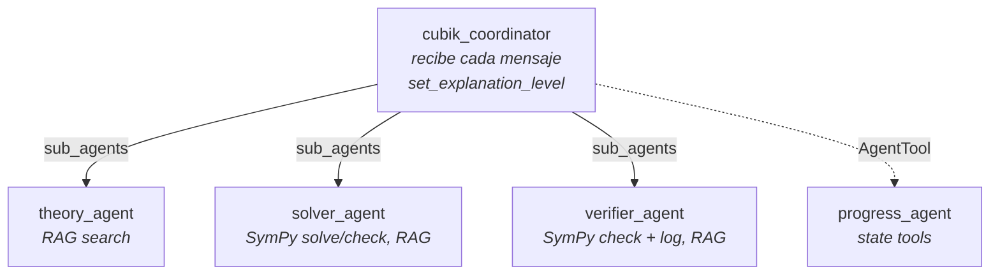

# Diseño multiagente (Corte 2)

Este documento define el equipo de agentes que reemplaza al tutor único de
[`agents/cubik_tutor/`](../agents/cubik_tutor/agent.py) para Corte 2. Refina la propuesta de
[PROPOSAL.md](../PROPOSAL.md) (un agente de triage más agentes que resuelven) con los patrones de la semana 8:
handoff con `sub_agents`, `AgentTool` y workflow agents. La implementación está en
[`agents/cubik_team/agent.py`](../agents/cubik_team/agent.py).

El problema no cambia: tutoría de cálculo integral fundamentada en `data/` mediante RAG. Cambian dos cosas:

- Cada agente tiene una instrucción y unas tools más acotadas, en lugar de un solo prompt que cubre todos los
  casos.
- Los resultados matemáticos ya no dependen del modelo: se calculan y se comprueban con **SymPy**. El LLM explica
  y redacta el paso a paso, pero la respuesta final y el veredicto de si una respuesta es correcta salen de un
  cálculo simbólico.

## 1. Equipo

Un coordinador clasifica cada mensaje y lo envía a uno de cuatro especialistas. Las `description` van en inglés
porque son el texto exacto que ADK le muestra al modelo para enrutar.

| Agente | Responsabilidad | `description` | Tools |
|---|---|---|---|
| `cubik_coordinator` (raíz) | Recibe cada mensaje, lo enruta, rechaza lo que está fuera de alcance y guarda la preferencia de detalle. | Entry point of the integral calculus tutor: classifies each student message and routes it to the right specialist. | `set_explanation_level`, `AgentTool(progress_agent)` |
| `theory_agent` | Responde preguntas conceptuales. | Explains integral calculus concepts, definitions and theorems (e.g. why +C, the Fundamental Theorem), citing the knowledge base. Does not solve or check specific exercises. | `search_knowledge_base` |
| `solver_agent` | Resuelve un ejercicio que el estudiante trae sin respuesta. | Solves a specific integral the student asks to be solved, step by step, naming the technique and the rule behind each step. Does not answer theory questions or check the student's own answers. | `solve_integral`, `search_knowledge_base`, `check_antiderivative`, `check_definite_integral`, `log_practice_attempt` |
| `verifier_agent` | Revisa la respuesta (o el paso a paso) que trae el estudiante. | Checks the student's own answer to a specific integral against an exact SymPy computation, and explains the mistake if it is wrong. Does not solve exercises the student has not attempted. | `check_student_antiderivative`, `check_student_definite_integral`, `search_knowledge_base` |
| `progress_agent` | Resume el progreso o reinicia el registro de práctica. | Summarizes the student's practice progress per technique, or resets their practice log. | `get_progress_summary`, `reset_practice_log` |

La frontera entre `solver_agent` y `verifier_agent` es qué trae el estudiante:

- Solo el ejercicio ("resuelve ∫ x·e^x dx") → `solver_agent`.
- El ejercicio **y su respuesta o su paso a paso** ("¿está bien? ∫ x·e^x dx = x·e^x − e^x + C") →
  `verifier_agent`.

`search_knowledge_base`, `set_explanation_level`, `log_practice_attempt`, `get_progress_summary` y
`reset_practice_log` son las tools de `agents/cubik_tutor/agent.py`. Se importan de ahí, no se duplican. Las tools
de SymPy son nuevas (sección 3).

## 2. Tipo de delegación

| Especialista | Delegación | Por qué |
|---|---|---|
| `theory_agent` | `sub_agents` (handoff) | Le responde directamente al estudiante con el formato JSON; el coordinador no tiene nada que agregar. |
| `solver_agent` | `sub_agents` (handoff) | Le responde directamente al estudiante con el paso a paso. |
| `verifier_agent` | `sub_agents` (handoff) | Le responde directamente al estudiante con el veredicto y la explicación del error. |
| `progress_agent` | `AgentTool`, llamado por el coordinador | Devuelve datos cortos que el coordinador incluye en su propia respuesta. |

Los tres especialistas con `sub_agents` **no pueden transferir** (`disallow_transfer_to_parent` y
`disallow_transfer_to_peers` en `True`). Responden el mensaje que les llega y el siguiente vuelve al
coordinador. La sección 5 explica por qué.

El solver no necesita al verificador como agente para revisar su propio resultado: llama directamente a la
función `check_antiderivative` o `check_definite_integral`, que es determinista y no gasta llamadas al modelo.

## 3. Tools de SymPy

Las de cálculo viven en [`math_tools.py`](../math_tools.py), en la raíz del repo (junto a `retriever.py`).
Reciben las expresiones como texto. Aceptan sintaxis de SymPy (`x*exp(x)`) y la notación habitual del
estudiante: `^` para potencias, multiplicación implícita (`2x`), `e` y `ln`.

| Tool | Entrada | Criterio | Salida |
|---|---|---|---|
| `solve_integral` | integrando, variable y, opcionalmente, límites | `sympy.integrate` | La antiderivada o el valor, o `closed_form: false` si SymPy no encuentra forma cerrada. |
| `check_antiderivative` | integrando, respuesta candidata, variable | `simplify(diff(candidata, x) − integrando) == 0` | `verdict` y la derivada de la candidata para explicar el error. |
| `check_definite_integral` | integrando, límites, valor candidato | `simplify(candidato − integrate(integrando, (x, a, b))) == 0` | `verdict` y el valor exacto. |

Estos son los "parámetros" con los que se decide si una respuesta está bien: derivar la antiderivada y comparar
con el integrando, o comparar con el valor exacto de la integral definida. La constante de integración no
afecta la comprobación, porque su derivada es 0.

`verdict` tiene tres valores: `correct`, `incorrect` y `unconfirmed`. El último aparece cuando `simplify` no
logra demostrar la igualdad pero tampoco hay un punto donde la diferencia sea distinta de 0. Algunas
identidades trigonométricas caen aquí, y no se deben marcar como incorrectas.

El verificador no usa estas funciones directamente, sino dos envoltorios definidos en `agent.py`:
`check_student_antiderivative` y `check_student_definite_integral`. Comprueban la respuesta **y** registran el
intento con `log_practice_attempt` en la misma llamada, con `solved = (verdict == "correct")`. Así el registro
de progreso no depende de que el modelo se acuerde de hacer una segunda llamada. Un veredicto `unconfirmed` o
una entrada inválida no se registran.

Al principio solo se comprueba la **respuesta final**. Para señalar *en qué paso* está el error, el LLM tendría
que convertir cada paso del estudiante en una expresión, y SymPy tendría que comprobar que cada una es
equivalente a la anterior. Queda como mejora posterior.

## 4. Diagrama

Las flechas continuas son handoffs (`sub_agents`); la punteada es un `AgentTool`, que le devuelve el resultado
al coordinador en lugar de responderle al estudiante.

## 5. Cambio de tema dentro de una conversación

Por defecto, con `sub_agents`, ADK no devuelve el control al coordinador al final de cada turno: el siguiente
mensaje lo recibe el último agente que respondió, siempre que pueda transferir
(`Runner._find_agent_to_run`). Cada especialista tendría que darse cuenta de que el tema cambió y llamar a
`transfer_to_agent`.

El primer diseño hacía eso, con reglas de transferencia en la instrucción de cada especialista. En las pruebas
con `qwen2.5:14b` el cambio de tema falló seguido:

- el especialista escribía la transferencia como texto (`transfer_to_agent "cubik_coordinator"`) en lugar de
  llamar a la tool, y el turno quedaba sin respuesta;
- el especialista respondía fuera de su alcance (el verificador contestando "¿cómo voy?" él mismo).

Por eso los especialistas tienen las transferencias desactivadas. Un agente que no puede transferir no es
"transferible en el árbol", así que ADK manda el siguiente mensaje a la raíz. El resultado:

- **Todo el enrutamiento está en un solo agente**, el coordinador, que ve el historial completo. Los
  especialistas no deciden a dónde va la conversación; solo responden.
- **Los seguimientos también pasan por el coordinador.** Su instrucción dice que un seguimiento sobre la
  respuesta anterior ("¿y por qué?", "explícame el paso 2") va al especialista que la dio.
- **Costo:** una llamada extra al modelo por turno, la del coordinador.

## 6. Estado

Se mantienen los alcances de la semana 7 (ver [adk_agent.md](adk_agent.md#2-tools-y-alcance-del-estado)).

| Clave | Quién escribe | Quién lee |
|---|---|---|
| `user:explanation_level` | Coordinador (`set_explanation_level`) | Todos los agentes que hablan con el estudiante, en su instrucción; `progress_agent` |
| `practice_log`, `app:total_attempts_all_users` | `verifier_agent` (automático, en `check_student_*`); `solver_agent` (`log_practice_attempt`); `progress_agent` (`reset_practice_log`) | `progress_agent` (`get_progress_summary`) |
| `temp:last_sources` | Los agentes que llaman a `search_knowledge_base` | — |

Quién registra cada intento:

- **`verifier_agent`**: siempre que revisa una respuesta del estudiante con veredicto `correct` o
  `incorrect`. `solved` sale de SymPy, no de lo que opine el modelo.
- **`solver_agent`**: cuando guía al estudiante en un ejercicio y el estudiante participa en la resolución, igual
  que el tutor de la semana 7.

`AgentTool` ejecuta al sub-agente en una sesión aparte, pero copia el estado de la sesión principal al empezar y
devuelve sus cambios (`state_delta`) al terminar. Por eso `progress_agent` puede leer y reiniciar
`practice_log` de la sesión real.

## 7. Prompts y formato de salida

Las instrucciones viven en [`prompts/team/`](../prompts/team/):

- `shared.txt`: una versión compacta de `prompts/system_prompt.txt` (alcance, tono, idioma, grounding,
  preferencia de detalle y formato JSON). La comparten los agentes que hablan con el estudiante. Con el
  `system_prompt.txt` completo repetido en cada agente, el modelo local perdía las reglas del final y llegó a
  inventar otro formato de JSON.
- `coordinator.txt`, `theory.txt`, `solver.txt`, `verifier.txt`: el rol de cada agente, que se agrega después
  de `shared.txt`.
- `progress.txt`: la instrucción completa de `progress_agent`, que no habla con el estudiante.

`prompts/system_prompt.txt` no cambia: lo siguen usando `main.py` y `cubik_tutor`.

Formato de salida:

- **Hablan con el estudiante:** `cubik_coordinator`, `theory_agent`, `solver_agent` y `verifier_agent`
  responden con el JSON de siempre (`answer`, `steps`, `rule`, `confidence`, `source`). El coordinador solo
  responde él mismo cuando rechaza un mensaje fuera de alcance o reporta el progreso.
- **Respuesta interna:** `progress_agent` le devuelve al coordinador el resumen en texto, sin el JSON del
  estudiante.
- Cuando el resultado viene de SymPy, `confidence` refleja la comprobación: alta si SymPy confirmó la respuesta,
  baja si no encontró forma cerrada o no pudo demostrar la equivalencia.

Todos los agentes del equipo usan `temperature=0.2`. Con la temperatura por defecto, el modelo local llegó a
cambiar de idioma a mitad de una respuesta.

## 8. Implementación y pruebas

- `math_tools.py` con las tres tools de SymPy, y `sympy` en `requirements.txt`.
- `agents/cubik_team/agent.py` con `root_agent = cubik_coordinator`. `agents/cubik_tutor/` no se toca: los dos
  aparecen en `adk web agents` y se pueden comparar.
- Mismo modelo y mismo switch Gemini/Ollama de `llm_client.py` que el tutor de la semana 7.
- Tests sin modelo:
  - `tests/test_math_tools.py`: respuestas correctas, incorrectas, con distinta constante de integración,
    equivalentes pero escritas distinto, identidades trigonométricas, integrales definidas, `unconfirmed` y
    expresiones que SymPy no puede leer.
  - `tests/test_cubik_team.py`: estructura del árbol (hijos del coordinador, qué tools y `AgentTool` tiene cada
    agente), que los especialistas no puedan transferir y que ADK devuelva el siguiente mensaje al coordinador,
    que las tools compartidas sean las de `cubik_tutor`, que los prompts se carguen de `prompts/team/`, y que
    `check_student_*` registre el intento solo con un veredicto definitivo.
- Prueba manual en una sola sesión, con `qwen2.5:14b`: teoría → ejercicio → seguimiento ("¿por qué ahí se usa
  integración por partes?") → respuesta incorrecta del estudiante → "¿cómo voy?". Los cinco mensajes llegaron
  al agente correcto, el verificador registró el intento y el resumen de progreso lo reflejó.

## 9. Riesgos

- **Conversión de notación.** El LLM tiene que traducir lo que escribe el estudiante a sintaxis de SymPy. Si
  traduce mal, SymPy comprueba otra expresión. Las tools devuelven la expresión que interpretaron, y el
  verificador se la muestra al estudiante para que el error sea visible.
- **Integrales sin forma cerrada.** Si `sympy.integrate` devuelve la integral sin evaluar, el solver lo dice en
  lugar de inventar un resultado.
- **Calidad del paso a paso.** El resultado sale de SymPy, pero los pasos los redacta el modelo. En las pruebas,
  cuando la búsqueda devolvió chunks de otra técnica (sustitución para un ejercicio de partes), el solver mezcló
  las dos en los pasos aunque la respuesta final fuera correcta.
- **Instrucciones que el modelo local no siempre sigue.** En las pruebas con `qwen2.5:14b`: el verificador dio
  la solución completa aunque la instrucción dice que no lo haga si el estudiante no la pide, un seguimiento de
  teoría se respondió sin llamar a `search_knowledge_base`, y algunos campos salieron como `""` o `[]` en vez de
  `null`. Ninguno rompe el flujo, pero hay que volver a probar con Gemini, el proveedor del proyecto.
